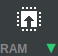

[nodeconf 2022](https://www.nodeconf.eu/workshops/integrate-external-hardware-into-your-website) - Writing a Bangle.js app
========================================================================================================================

## Getting Started

* First, turn on the Bangle if it's not already on - you'll need to hold down the button for around 2 seconds.
  * As soon as the screen changes from black, let go of the button so you don't enter bootloader mode.
* Now, Bangle.js is booted and you should see something like this:


In the top right of the screen are 4 letters/digits (in this case `e115`) and these
represent the Bangle's Bluetooth name (so you know which device to connect to).

Bangle.js 2's main means of interaction is the touchscreen:

* Normally Bangle.js is locked (top left padlock icon). To unlock it press the button
* When on the clock and unlocked, press the button to enter the launcher
  * scroll up and down in the launcher and tap to select the app to launch
  * press the button again in the launcher to return to the clock
* When in an app, hold the physical button for ~2 seconds to return to the clock
* If you see a red circle with a back arrow in the corner it means you can go back - either by tapping the icon or pressing the physical button


## Connecting


* Go to https://www.espruino.com/ide **in Chrome** and in the top left, click the connect icon: 

* Now choose `Web Bluetooth` from the `Select a Port...` dialog
  * If you don't see `Web Bluetooth`, click the `status` link for more information
    and ask if you're not sure what to do
* In the `espruino.com wants to pair` window that pops up, look down the
  list for a device called `Bangle.js e115` (with the last 4 letters matching
  those written on your device).
*  Once paired the IDE's connect icon should turn green and `>` will appear on
the left-hand side, and the Bluetooth symbol in the corner of the Bangle should turn blue.

## Trying stuff out

The IDE is made of two main parts:

* On the left (in black) is the REPL. This allows you to communicate directly with the Bangle.js
and issue commands.
* On the right (in white) is the editor. This is a JavaScript editor. This has no effect on
what happens in Bangle.js until you click the `Upload / Send to Espruino` button: 
  * Clicking the down-arrow by the upload button chooses how you want to upload the code. The default is `RAM` which
  is best for development, or you can upload to a file in the Bangle's onboard storage. `Flash` shouldn't be used on Bangle.js


* On the left-hand side (the REPL), type `reset()` and enter. This will remove
any currently-running code from the Bangle (like the clock) so it doesn't interfere
with what you're doing.
* Type typing `Bangle.buzz()` - it'll make the Bangle's vibration motor turn
on for an instant.
  * You can find a full reference of functionality that's available at http://www.espruino.com/ReferenceBANGLEJS2
* Try `E.showAlert("Uh-oh").then(() => Bangle.buzz())` - this will display an alert window, and when the button on the screen is tapped the promise will be completed and the Bangle will buzz
  * You may not immediately be able to press the button because the screen is locked (press the physical button to unlock). Normally widgets would be loaded
    so the lock widget would show a padlock symbol when the screen is locked (but we haven't loaded widgets yet).


* Type `g.clear(1)` - this will clear the screen of the Bangle (`1` causes the draw style to be reset too, which could be done with `g.reset()` too)
  * You can see a list of Graphics functions available to you at http://www.espruino.com/ReferenceBANGLEJS2#Graphics
* Try `g.setFont("Vector",50).drawString("Hello",10,10)` - this draws 'Hello' 10px from the top and left.
  * Most Graphics calls return the Graphics instance, so they can be chained
  * Espruino contains a few fonts (see `g.getFonts()`). The `Vector` font can be scaled
    to any required size, however other fonts are bitmap fonts and can only be
    scaled by integer factors.


* Now let's make a counter. Paste in:

```JS
var count = 0;
function next() {
  count++;
  g.clear(1);
  g.setFont("Vector",50).drawString(count,10,10);
}var count = 0;
function next() {
  count++;
  var R = Bangle.appRect;
  g.reset().clearRect(R);  
  g.setFont("Vector",70).setFontAlign(0,0).drawString(count,R.x + R.w/2, R.y + R.h/2);
}


Bangle.loadWidgets();
Bangle.drawWidgets();
next();
setInterval(next, 1000);
next();
```

* You can press up-arrow to select the last entered line (`next()`) and press
`Enter` to execute it again, and the counter will count up.
* Now make it count up automatically with `setInterval(next, 1000)`

The `next` function is now running every second, but we can still interact
with the Bangle via the REPL (much like you might with the browser's devtools).

* Type `count=0` and the counter will be reset.

* Paste the following in. This will take effect within a second the next time that
`next` is called. It'll center-align the text in the available
screen area (when we load widgets, the top 24px is used top display them):

```JS
function next() {
  count++;
  var R = Bangle.appRect;
  g.reset().clearRect(R);  
  g.setFont("Vector",70).setFontAlign(0,0).drawString(count,R.x + R.w/2, R.y + R.h/2);
}
```

* Finally, let's add widgets:

```JS
Bangle.loadWidgets();
Bangle.drawWidgets();
```

Everything's getting a bit more complicated now so it's worth adding everything
to the right-hand side of the IDE for quicker editing. Copy this in:

```JS
var count = 0;
function next() {
  count++;
  var R = Bangle.appRect;
  g.reset().clearRect(R);  
  g.setFont("Vector",70).setFontAlign(0,0).drawString(count,R.x + R.w/2, R.y + R.h/2);
}


Bangle.loadWidgets();
Bangle.drawWidgets();
next();
setInterval(next, 1000);
```

* Ensure the `Send to Espruino` button in the middle of the screen is set to
`RAM` and then click it - uploading the code from the window will overwrite the
previous code that was running in Espruino with the code from the editor (but you
  can still tweak it from the REPL).

## Saving as an app

* Click on the down-arrow next to the `Send to Espruino` button, and click `Storage`
* Click `New file`
* Type `counter.app.js`
* Now click the `Send to Espruino` button to upload the code.

The code will automatically run after upload. However the app itself will not appear in the launcher.

To make it appear in the launcher, you need an `info` file. Copy and paste this
into the **left** hand side of the IDE:

```JS
require("Storage").write("counter.info",{
  "id":"counter",
  "name":"Counter",
  "src":"counter.app.js"
});
```

Now if you long-press the button to return to the clock, then press again to
enter the launcher you should see a menu item, and choosing that will launch your
app.

**Note:** Creating the `counter.info` file manually is just for development. The
app loader normally automatically creates this file. Check out http://www.espruino.com/Bangle.js+App+Loader
for more information about adding to the app loader.


## User Interaction

Bangle.js provides a few different ways to interact with the hardware.

* There are events on the `Bangle` object, like [`Bangle.on('touch', print)`](http://www.espruino.com/ReferenceBANGLEJS2#l_Bangle_touch)
* You can watch the hardware button with a low-level call to `setWatch(print, BTN, {repeat:true})`
* You can use the `Layout` library to lay out items on the screen as well as handling user input: https://www.espruino.com/Bangle.js+Layout
* You can use `Bangle.setUI` which attempts to handle user input in a way that will work on multiple different devices (like Bangle.js 1 + 2 currently): http://www.espruino.com/ReferenceBANGLEJS2#l_Bangle_setUI

Both `Layout` and `Bangle.setUI` are recommended, as 'old' listeners are transparently removed when new ones are added.

Built-in menus like `E.showMenu`, `E.showPrompt`, `E.showAlert` etc use `Bangle.setUI` internally so will work alongside other code that uses `setUI`.

See the docs at http://www.espruino.com/ReferenceBANGLEJS2#l_Bangle_setUI for more information on the input modes available, but
as an example, let's allow our counter to be changed by dragging up and down.

* Add this to the end of the code and click `Send to Espruino` again :

```
Bangle.setUI("updown", dir => {
  if (!dir) return; // it's just a tap
  // if dir is a number we are scrolling up or down
  count += dir;
  count--; // next() will increment count, so lets pre-decrement it
  next(); // call next() to redraw the screen  
});
```

Now if the Bangle is unlocked, you can drag up and down to change the counter.

## Next...

For more ideas, check out the list of tutorials at http://www.espruino.com/Bangle.js2#tutorials

Now you might want to look at the [next part of the tutorial...](website.md)
